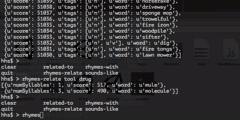

# HipHop Shell
Tab Completion is your friend.


When Words fail, but the cli calls out to you




## Installation

You can do a local install by downloading this repo then running the install:

```bash
git clone https://github.com/bsdpunk/trash
cd trash
sudo python setup.py install
```

